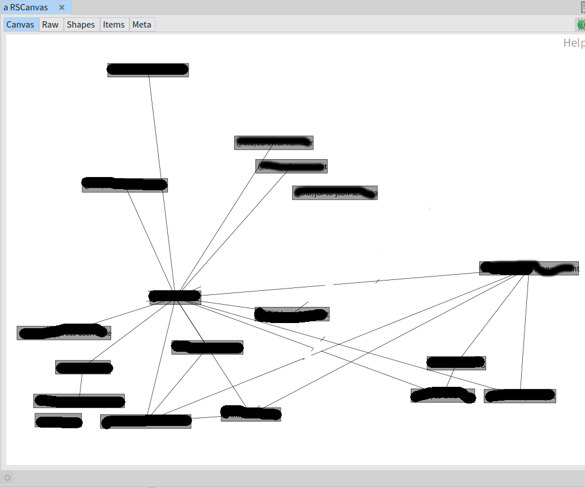

About Moose 
=======================================

[Moose](https://moosetechnology.org/) is very interesting technology to help high level analysis of software patterns across an organization or large project.

It mostly focuses on the relationships of classes, or querying characteristics of source code.

About Enterprise Javascript Analysis
=======================================

I have problems around analysis of many small modules or Node.js microservices.

The first use case: What library depends on what library?
----------------------------------------

At work our project as a whole has something like two dozen libraries. Some are maintained by my sub team directly, some are maintained by others.

But all these libraries build on each other - every module uses our standard error library, for example, because of enterprise reasons.

I knew this by knowing the [gestalt](https://www.dictionary.com/browse/gestalt) of the system well, but I also... well, it's a complex network graph.

So: can I draw a diagram based on what library depends on what other internal libraries?

Moose focuses on classes, and not so much on the relationship of packages.

### Example of generated output

Names blanked for some OpSec.

Notice there's a number of somewhat complex dependencies: one of our leaves depends of a leaf which depends on a leaf which depends on a (that center library in the middle). Notice also there's a library that depends on nothing, and no libary depends on it. This in fact matches the use of that module. 

Requirements
=======================================

Uses:

  * STON
  * [Roassal3](https://github.com/ObjectProfile/Roassal3)